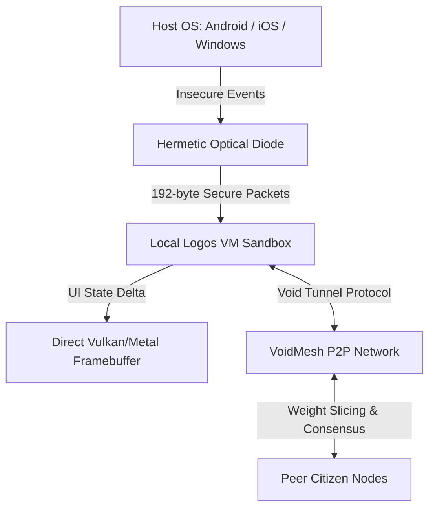
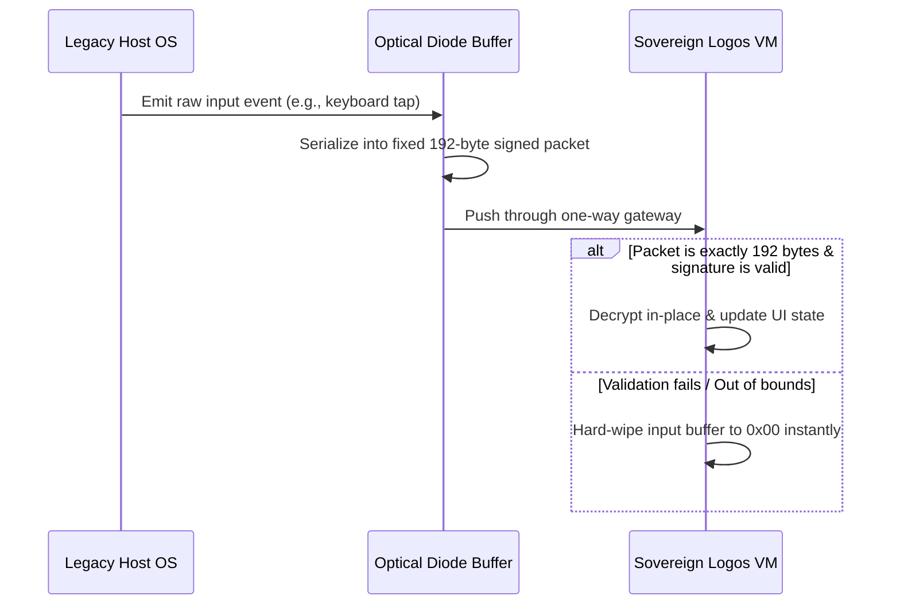

# Architectural Specification — Decentralized Local Walled Garden App

To deliver **Truth** as a downloadable mobile and desktop application that matches the Void Ideology, we must reject corporate centralized hosting and establish a **Local Walled Garden**. Each citizen's device operates as a sovereign peer node in a decentralized mesh, executing logic locally while insulating the system from host OS compromises.

---

## 1. Core Architecture

### A. The Local VM Sandbox
Instead of running a web view, Electron wrapper, or React Native stack (which import billions of lines of unverified JS/C++ code), the client application contains only:
1. A lightweight, pre-compiled **Logos VM runtime** built in freestanding assembly or Rust (compiled to native machine code).
2. The compiled `.smir.json` (or `.vmf`) state machine representation of [system.logos](file:///c:/Users/voidi/OneDrive/Desktop/VOID%20Empire/voidos/system.logos).
3. A direct-to-framebuffer renderer (Vulkan, Metal, or OpenGL) that reads the current state of [telemetry_ui.logos](file:///c:/Users/voidi/OneDrive/Desktop/VOID%20Empire/voidos/telemetry_ui.logos) and paints the user interface.

### B. Decentralized Node Mesh (`VoidMesh`)
Each client runs a local peer node defined by [voidmesh.logos](file:///c:/Users/voidi/OneDrive/Desktop/VOID%20Empire/voidos/voidmesh.logos).
* **Node Challenge Verification**: When joining the network, nodes must pass a cryptographic challenge (`peer_challenge_verify`) proving they hold valid citizen keys generated during the [KeyGeneration](file:///c:/Users/voidi/OneDrive/Desktop/VOID%20Empire/voidos/telemetry_ui.logos#L129-L135) phase.
* **Consensus-Driven Intelligence**: For TLI queries, rather than sending prompt text to a central server, the node performs matrix pathfinding locally. If the computation is too large, the node splits the attention matrix and broadcasts slices (`dispatch_weight_slice`) to nearby peers, verifying the result through a consensus quorum (`verify_consensus_pass`).

---

## 2. Military-Grade Host Isolation (Hermetic Gateway)

The primary threat to any mobile or desktop app is the host operating system itself (keyloggers, memory scraping, process injection). The **Local Walled Garden** mitigates this by applying the [CryptographicHermeticProtocol](file:///c:/Users/voidi/OneDrive/Desktop/VOID%20Empire/voidos/hermetic_gateway.logos#L32-L102):

### Key Security Protocols:
1. **Unidirectional Event Diode**: Host OS events (taps, keystrokes) are serialized into a rigid 192-byte payload format and passed through a unidirectional data diode (`OpenUnidirectional` state in [HermeticGateway](file:///c:/Users/voidi/OneDrive/Desktop/VOID%20Empire/voidos/hermetic_gateway.logos#L7-L30)). The host OS cannot read the VM's internal memory state or query registers.
2. **Atomic Buffer Wiping**: If a malformed packet, buffer overflow payload, or unauthorized interrupt is detected, the gateway immediately transitions to `DropAndClearBuffer` and zero-fills the entire memory buffer, insulating the inner garden.
3. **No Dynamic Allocations**: The application uses a static memory block allocated at boot time via [memory_manager.logos](file:///c:/Users/voidi/OneDrive/Desktop/VOID%20Empire/voidos/memory_manager.logos), preventing stack/heap smashing attacks.

---

## 3. Edge TLI (Topological Latticed Intelligence)

Traditional AI models are too massive to run on phones. However, **Topological Latticed Intelligence (TLI)** replaces autoregressive next-token prediction with thermodynamic coordinate relaxation across a multi-dimensional state lattice.

* **Lightweight Relaxation**: Solving the pathfinding equation:
  $$\min_{\mathcal{P}} \sum_{j \in \mathcal{P}} \left( \Delta E_j + T \Delta S_j \right)$$
  requires simple vector matrix calculations. This is highly optimized for mobile GPUs and NPUs, meaning **Truth** can run fully offline on a smartphone without internet access.
* **Subnet Sovereignty**: Different subnets within the mesh specialize in different coordinate lattices (e.g., science, cryptography, communication). The local node dynamically syncs with subnets relevant to the citizen's active quests.

---

## 4. Thermodynamic Economy

In a decentralized Walled Garden, citizens are not product data; they are resource nodes. The app integrates [treasury.logos](file:///c:/Users/voidi/OneDrive/Desktop/VOID%20Empire/voidos/treasury.logos) directly:

* **Resource Sharing**: A citizen's device can go into "Companion Mode" when idle (charging overnight), dedicating its CPU/GPU to solve TLI pathfinding queries for active peers.
* **UBI and Resource Allocation**: In exchange for sharing compute cycles, the node is credited with `energy` and `cycle` budgets locally, which can be spent to run local queries or execute smart state transitions on the mesh.

---

## 5. Implementation Strategy

To transition to this model, we would need to:
1. **Build a Lightweight Mobile/Desktop VM Launcher**: A small native executable (written in Rust or C, utilizing hardware-accelerated Vulkan/Metal binding layers) that hosts the compiled `logos_vm` engine.
2. **Implement VTP Loopback**: Bind the local UI client directly to a loopback VTP port, so it communicates with the local peer node using the standard [Void Tunnel Protocol](file:///c:/Users/voidi/OneDrive/Desktop/VOID%20Empire/README.md#L34-L39).
3. **P2P Node Discovery**: Connect `voidmesh` to local networks (Bluetooth, Wi-Fi Direct, and decentralized P2P internet routing) to establish immediate peer links without DNS dependencies.
